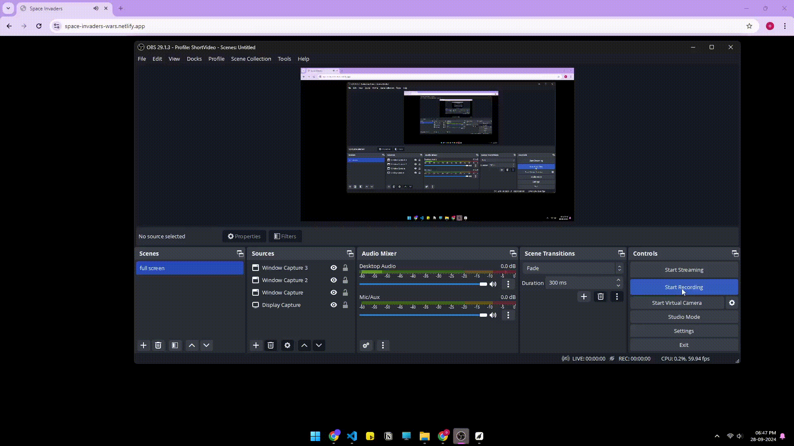

# Space Invaders - Alien Attack 🌌👾

A retro-inspired browser game where you defend Earth from an alien invasion! Built using HTML, CSS, and JavaScript, this game puts you in command of a space fighter to shoot down waves of aliens.

## Demo Link
Click Here: https://space-invaders-wars.netlify.app

## Preview




## 🛠 Project Overview

This game was created for the **"Design and build a browser game with HTML/CSS/JS that incorporates Aliens as a theme"** developer challenge. The focus is on creating an engaging frontend experience, with the game fully playable in any modern web browser.

## 🎮 Gameplay

- **Goal:** Protect Earth by shooting down waves of alien invaders.
- **Controls:**  
  - Move left: `← Arrow`  
  - Move right: `→ Arrow`  
  - click top arrow: `Spacebar`  
- **Objective:** Survive as long as possible while scoring points by destroying alien ships.

## 🚀 Features

- **Retro Aesthetic:** Classic pixelated graphics reminiscent of 1980s arcade games.
- **Responsive Design:** Playable on desktop and mobile devices.
- **Wave Progression:** The game gets progressively harder as you clear more waves of aliens.
- **Sound Effects:** Immersive sound effects to enhance the action-packed gameplay.
- **High Score Tracking:** Keep track of your highest scores across game sessions (optional backend).

## 🔨 Technology Stack

- **Frontend:**  
  - HTML5 for structure  
  - CSS3 for styling  
  - JavaScript for game logic and interactivity  
- **Optional:**  
  - Backend/API for high score persistence (Node.js or similar)
  - LocalStorage for high score tracking (if no backend is used)

## 🖥 Installation & Setup

1. Clone the repository:
   ```bash
   git clone https://github.com/your-username/space-invaders-alien-attack.git
   cd space-invaders-alien-attack
